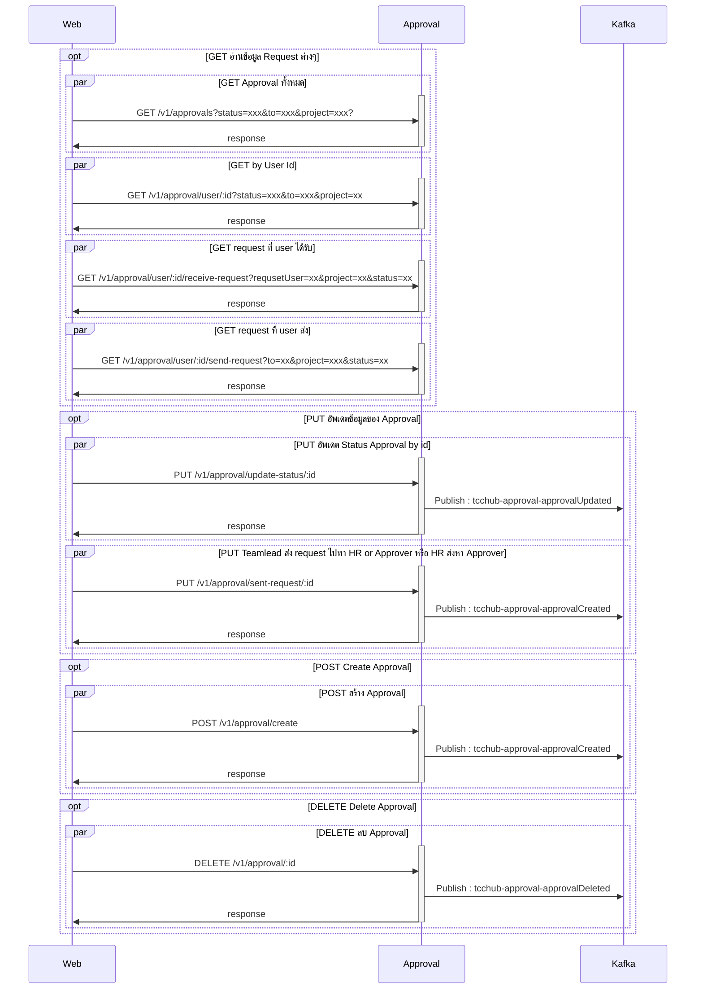

### APIs

```mermaid 
sequenceDiagram
    participant Web
    participant Approval
    participant Kafka
    
opt GET อ่านข้อมูล Request ต่างๆ
    par GET Approval ทั้งหมด
        activate Approval
        Web->>Approval : GET /v1/approvals?status=xxx&to=xxx&project=xxx?
        Approval->>Web : response
        deactivate Approval
    end
    par GET by User Id 
    activate Approval
        Web->>Approval : GET /v1/approval/user/:id?status=xxx&to=xxx&project=xx
        Approval->>Web : response
        deactivate Approval
    end
    par GET request ที่ user ได้รับ
    activate Approval
        Web->>Approval : GET /v1/approval/user/:id/receive-request?requsetUser=xx&project=xx&status=xx
        Approval->>Web : response
        deactivate Approval
    end
    par GET request ที่ user ส่ง
    activate Approval
        Web->>Approval : GET /v1/approval/user/:id/send-request?to=xx&project=xxx&status=xx
        Approval->>Web : response
        deactivate Approval
    end
end

opt PUT อัพเดตข้อมูลของ Approval
    par PUT อัพเดต Status Approval by id
        activate Approval
        Web->>Approval : PUT /v1/approval/update-status/:id
        Approval->>Kafka: Publish : tcchub-approval-approvalUpdated
        Approval->>Web : response
        deactivate Approval
    end
    par PUT Teamlead ส่ง request ไปหา HR or Approver หรือ HR ส่งหา Approver 
        activate Approval
        Web->>Approval : PUT /v1/approval/sent-request/:id
        Approval->>Kafka: Publish : tcchub-approval-approvalCreated
        Approval->>Web : response
        deactivate Approval
    end
end
opt POST Create Approval
    par POST สร้าง Approval 
        activate Approval
        Web->>Approval : POST /v1/approval/create
        Approval->>Kafka: Publish : tcchub-approval-approvalCreated
        Approval->>Web : response
        deactivate Approval
    end
end

opt DELETE Delete Approval
    par DELETE ลบ Approval 
        activate Approval
        Web->>Approval : DELETE /v1/approval/:id
        Approval->>Kafka: Publish : tcchub-approval-approvalDeleted
        Approval->>Web : response
        deactivate Approval
    end
end

```
